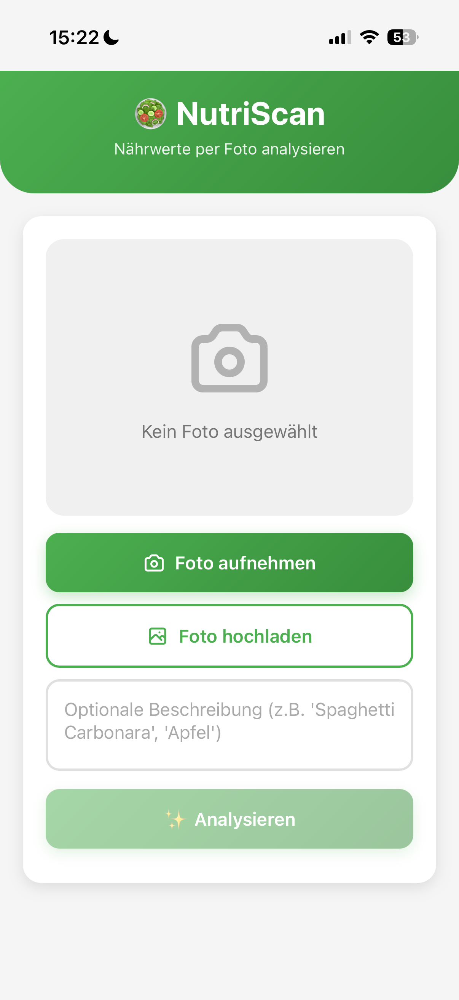
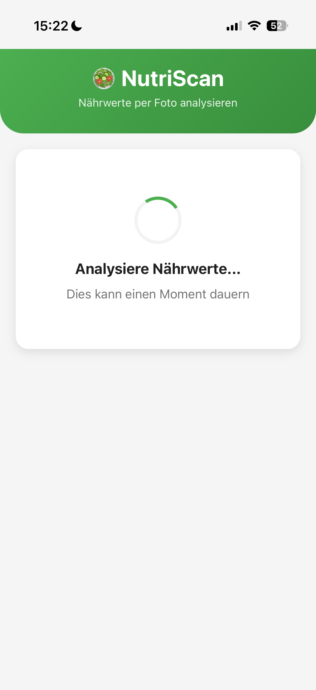
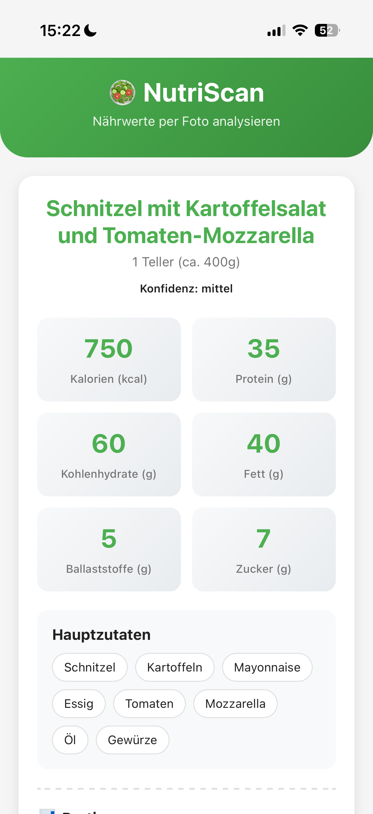
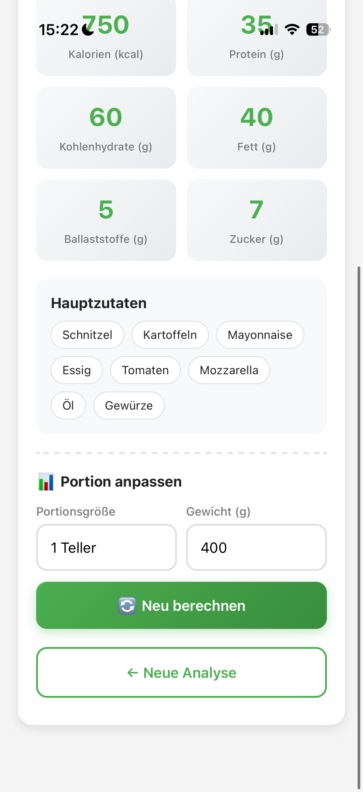

# 🥗 NutriScan - KI-gestützte Nährwertanalyse

Eine Progressive Web App (PWA) für iPhone, die Lebensmittelfotos mit ChatGPT analysiert und detaillierte Nährwertinformationen liefert.


## ✨ Features

- 📸 **Direkte Kamera-Integration** - Fotografiere dein Essen direkt in der App
- 🤖 **KI-Analyse** - GPT-4 Vision API analysiert Lebensmittel automatisch
- 📊 **Detaillierte Nährwerte** - Kalorien, Makronährstoffe, Zucker, Ballaststoffe
- ⚖️ **Flexible Portionen** - Passe Gewicht und Größe an, Werte werden neu berechnet
- 📱 **iPhone-optimiert** - Sieht aus wie eine native iOS App
- 💾 **PWA-fähig** - Installierbar auf dem Homescreen
- 🔒 **Sicher** - API Keys werden nicht gespeichert und in der URL mitgegeben

## 🖼️ Screenshots
<p align="center">
  
  
  
  
</p>

## 🚀 Quick Start

```bash
# Repository klonen
git clone https://github.com/emaa10/nutriscan.git
cd nutriscan

# Virtual Environment
python3 -m venv venv
source venv/bin/activate  # macOS/Linux
# oder: venv\Scripts\activate  # Windows

# Dependencies
pip install -r requirements.txt

# Starten
python app.py
```

Öffne: `http://localhost:8085/?token=sk-dein-openai-key`

**Wichtig:** Füge deinen OpenAI API Key als URL-Parameter hinzu!

## 📋 Voraussetzungen

- Python 3.9+
- OpenAI API Key ([hier erhalten](https://platform.openai.com))
- Moderner Browser (Chrome, Safari, Firefox)
- Für Production: HTTPS-Server (für Kamera-Zugriff)

**Hinweis:** Jeder Nutzer benötigt seinen eigenen OpenAI API Key. Es gibt keine zentrale Speicherung! Der Link mit einem Token in der URL kann aber jederzeit geteilt werden.

## 🏗️ Projekt-Struktur

```
nutriscan/
│
├── app.py              # Flask Backend
│   ├── /               # Main Route
│   ├── /analyze        # Bild-Analyse Endpoint
│   └── /recalculate    # Neuberechnung Endpoint
│
├── templates/
│   └── index.html      # Single-Page Frontend
│
├── requirements.txt    # Python Dependencies
├── .gitignore         # Git Ignore Rules
└── README.md          # Diese Datei
```

## 🎯 Technologie-Stack

**Backend:**
- Flask 3.0 - Web Framework
- OpenAI GPT-4o - Vision API für Bildanalyse
- Gunicorn - Production WSGI Server

**Frontend:**
- Vanilla JavaScript - Keine Framework-Bloat
- CSS3 - Modern mit CSS Variables
- Progressive Web App (PWA) - Installierbar

**APIs:**
- OpenAI Vision API - Lebensmittelerkennung
- Camera API - Direkter Kamera-Zugriff
- File API - Foto-Upload

## 📱 Als iPhone App installieren

1. Öffne die deployed URL in Safari
2. Tippe auf "Teilen" Icon (Quadrat mit Pfeil ↗️)
3. Scrolle zu "Zum Home-Bildschirm"
4. Tippe "Hinzufügen"
5. Die App erscheint als Icon auf deinem Homescreen

**Vorteile:**
- ✅ Vollbild ohne Browser-UI
- ✅ Eigenes App-Icon
- ✅ Schneller Zugriff
- ✅ Fühlt sich wie native App an

## 🔧 Konfiguration

### OpenAI Modell wechseln

In `app.py` Zeile 51:

```python
# Für beste Qualität (teurer)
model="gpt-4o"

# Für schnellere/günstigere Analyse
model="gpt-4o-mini"
```

### Prompt verbessern

In `app.py` ab Zeile 30, passe den Prompt an für:
- Andere Sprachen
- Spezielle Diäten (Keto, Vegan, etc.)
- Allergene-Erkennung
- Mehr Details

## 🐛 Bekannte Probleme

1. **Kamera funktioniert nur mit HTTPS**
   - Lösung: Nutze deployed Version oder Foto-Upload

## 🤝 Contributing

Contributions sind willkommen!

1. Fork das Projekt
2. Erstelle einen Feature Branch (`git checkout -b feature/AmazingFeature`)
3. Commit deine Changes (`git commit -m 'Add AmazingFeature'`)
4. Push zum Branch (`git push origin feature/AmazingFeature`)
5. Öffne einen Pull Request


## 📞 Support

Bei Fragen oder Problemen:
- 🐛 [Issue erstellen](https://github.com/emaa10/nutriscan/issues)
---

**⭐ Wenn dir das Projekt gefällt, gib ihm einen Star auf GitHub!**
